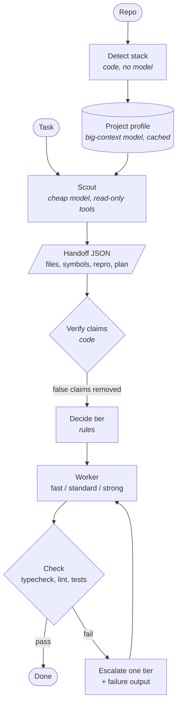

# megaprobe

**Scout first, then spend.** A staged model pipeline for coding agents:

1. **Detect** the stack from manifests. No model involved.
2. **Profile** the repo once with a big-context model, cached.
3. **Scout** each task with a cheap read-only model that returns a structured handoff: relevant files, symbols, repro command, constraints, plan.
4. **Verify** the handoff's claims in code and remove the false ones.
5. **Decide** which worker tier fits the task (rules first, pluggable later).
6. **Work** with the cheapest fitting worker: `claude -p` or `codex exec`, using your existing logins.
7. **Check** with typecheck, lint and focused tests, and escalate one tier on failure.

## How it works



Why this order: recent results show a verified repository handoff lets cheap models match the best single model at about ⅕ of the cost, and the handoff mattered more than choosing the model. See [the paper](docs/PAPER.md).

## Status

Design stage. [docs/PAPER.md](docs/PAPER.md) covers the design, prior work, engineering notes, the evaluation plan and the roadmap. No code yet.

## Planned usage (v0.1)

```sh
megaprobe profile                        # detect stack + build/refresh the cached profile
megaprobe scout  "fix token expiry bug"  # print the verified handoff
megaprobe run    "fix token expiry bug"  # full pipeline: scout → decide → work → check → escalate
megaprobe log                            # per-stage cost, tier, and check results of past runs
```

Configuration will live in `.megaprobe/config.json` (worker tiers, decision rules, check commands), and run history in `.megaprobe/runs/`.
