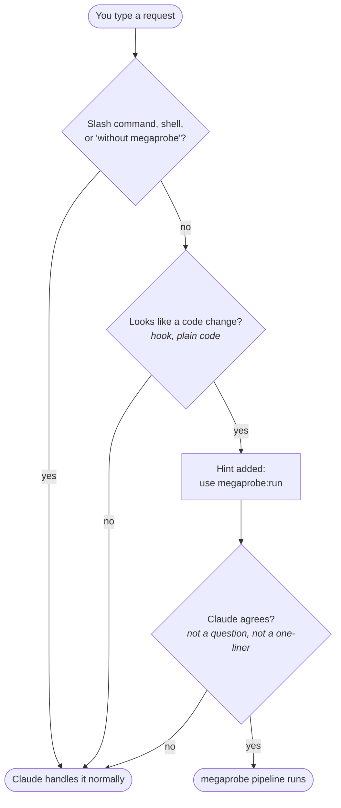
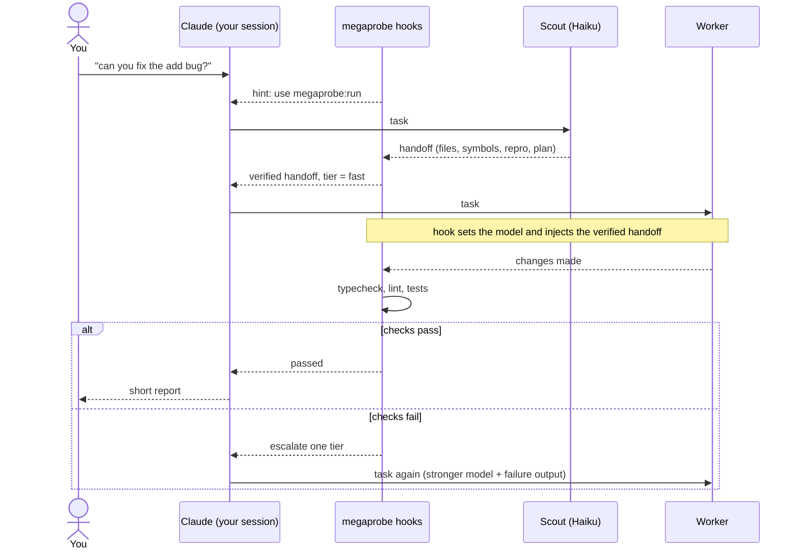

# Using megaprobe inside Claude Code

With the plugin installed you don't type any megaprobe commands. You ask for a change in plain words, as usual, and megaprobe routes it through a cheap scout and the cheapest worker that passes the checks.

```
/plugin marketplace add michaljach/megaprobe
/plugin install megaprobe@megaprobe
```

## 1. Does my prompt go through megaprobe?



Two things decide:

1. **A hook, in plain code (no model call).** It looks for a change request: verbs like *fix, add, rename, refactor, migrate*; polite requests like *"can you fix…"*; chained instructions like *"review and fix…"*. It skips questions (*"how do I…"*, *"what does…"*, *"explain…"*). If the prompt matches, it adds a one-sentence hint.
2. **Claude.** It reads the hint and still makes the call. A question, a discussion, or a one-line edit that needs no exploring is handled normally.

| You type | Goes through megaprobe? |
|---|---|
| `add(1, 2) returns -1, can you fix it?` | yes |
| `please rename verifyToken to verifyJwt everywhere` | yes |
| `Review and fix the error handling in src/api` | yes |
| `How do I add a new route here?` | no, it's a question |
| `explain the build pipeline` | no |
| `fix it, but without megaprobe this time` | no, opted out |
| `/megaprobe:run …` | always, explicitly |

## 2. What happens during a run



| Who | Does what | Model |
|---|---|---|
| **Claude (your session)** | Coordinates. It never reads the explored files or writes the code itself, so its context stays small | your session model |
| **Scout** | Explores the repo read-only and returns a handoff: files, symbols, a repro command, a plan | Haiku |
| **megaprobe hooks** | Verify every claim in the handoff and drop false ones, pick the tier, set the worker's model, run the checks, decide whether to escalate | none, plain code |
| **Worker** | Makes the change from the verified handoff | fast → standard → strong tier (Haiku → Sonnet → Opus by default) |

You still see Claude Code's normal permission prompts for the worker's edits and commands.

## Settings

In `.megaprobe/config.json`:

```json
{ "auto": "smart" }
```

| `auto` | Behaviour |
|---|---|
| `smart` (default) | Hint only when the prompt looks like a code change |
| `always` | Hint on every prompt; Claude decides each time |
| `off` | Only `/megaprobe:run` starts the pipeline |

- **Once per repo:** run `/megaprobe:profile`. It gives the scout and worker a summary of the project's architecture and conventions.
- **To skip megaprobe for one request:** say *"without megaprobe"*.

## Limits

- **English keywords only:** the intent check matches English keywords, so unusual phrasing or other languages can slip through. Claude reviewing the hint catches false alarms, but not misses.
- **Coordination overhead:** Claude's coordination costs something too. On a trivial one-line fix the whole run cost $0.16, most of it the coordinating model. The savings are meant for larger tasks, where your main model would otherwise read many files and write the code itself.
- **No per-run cost numbers:** hooks can't see what each subagent costs, so in-session runs log the tiers and check results but not dollars.
