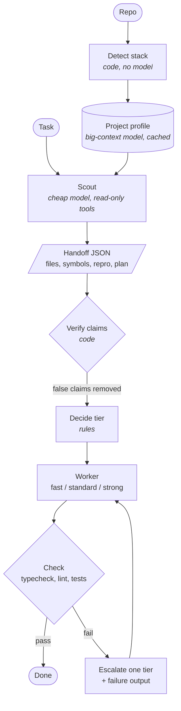

# megaprobe: scout first, then spend

**A staged model pipeline for coding agents: understand the codebase cheaply, pick the cheapest worker that can do the job, verify, escalate.**

Michal Jach · Draft 0.2 · September 2026

---

## Abstract

Coding agents usually run one strong model for everything: reading the repository, deciding what to do, writing the code, and checking it. Most of those steps don't need a frontier model. megaprobe splits the work into stages: a cached **project profile**, a cheap **scout** that explores the repo for the current task and writes a **verified handoff**, a **decision** step that picks a worker, a **worker** that does the job, and **verification** with the project's own tools, escalating one tier when a check fails. The design follows a recent result: a repository scout's handoff lets cheap models match the best single model at about a fifth of the cost, and in that result the handoff mattered more than the routing. megaprobe treats the scout as the main feature and the router as secondary.

## 1. Problem

A typical agent task spends its tokens in three places:

1. **Orientation.** Finding the relevant files, reading conventions, working out how to run and test things. This happens again on every task, even though most of it doesn't change between tasks.
2. **Deciding.** Choosing an approach, and in multi-model setups, choosing which model does the work.
3. **Doing.** Writing and editing code.

Only the third reliably needs a strong model, and often not even that. Orientation needs cheap reading at scale, and much of it can be cached. Deciding is mostly classification.

## 2. What prior work shows

| Work | What it found | What megaprobe takes from it |
|---|---|---|
| **SuperScout / "Scrouting"** ([arXiv 2608.04804](https://arxiv.org/abs/2608.04804)) | A 7B scout explores the repo, writes a structured handoff, and sandbox-checks its reproduction claims, removing false ones. The pipeline matches the best single model on the SWE-bench Pro Python slice (159/266) at about ⅕ of the cost per solve. **Always using the cheapest fixer with the handoff tied the routed system.** The handoff raised the cheaper fixers and slightly hurt the strongest one. | Make the scout and its verified handoff the core. Keep the router simple until data shows it adds something. |
| **Aider architect/editor** ([aider.chat](https://aider.chat/2024/09/26/architect.html)) | Planning with a strong model and editing with a cheaper one beats a single model on edit benchmarks and costs 30–50% less. | Planning and editing can go to different workers. |
| **ACRouter** ([arXiv 2606.22902](https://arxiv.org/abs/2606.22902)) | Routers fail mainly from missing information. Adding observed per-task-type performance statistics gave a 15.3% relative gain. | Log every outcome. Routing should learn from this repo's own history. |
| **JetBrains Mellum** ([HF](https://huggingface.co/JetBrains/Mellum-4b-sft-kotlin)) | Fine-tuning on a single language did not beat the multilingual model with preference tuning. | Don't route by language. Route by task type and difficulty. |
| **Qwen3-Coder-Next** ([arXiv 2603.00729](https://arxiv.org/html/2603.00729)) | Specialist experts, including web development, were distilled back into one generalist. | A general model is the default worker. |
| **Vercel v0 autofixer** ([Vercel](https://vercel.com/blog/v0-composite-model-family), [Fireworks](https://fireworks.ai/blog/vercel)) | A model trained with reinforcement fine-tuning for one narrow job (fixing errors) matches much larger models and runs 10–40× faster. | Specialists belong in the pool only for narrow jobs that can be checked automatically. |
| **Learned routers** (OpenRouter Auto / Pareto Code, Not Diamond, RouteLLM) | They route per request by task type and a cost/quality dial. | Useful as a decider backend later. They don't see the repository. |

Two conclusions follow:

- **Context beats selection.** Better input to a cheap model is worth more than a smarter choice of model.
- **Specialize by job, not by language.** Single-language models don't win. Models trained for one narrow job can.

## 3. Design



The profile is built once per repository and refreshed when manifests change. Everything from the scout down runs per task.

### 3.1 Stack detection (no model)

The language and framework come from files, not from a model: `package.json` dependencies, `tsconfig.json`, lockfiles, `pyproject.toml`, `go.mod`, `Cargo.toml`, file-extension counts. The output also includes the commands the verify stage will run (`tsc --noEmit`, `eslint`, `vitest`, `pytest`, …). This is deterministic, free, and changes only when the manifests change.

### 3.2 Project profile (one big-context pass, cached)

A long-context model reads a compressed view of the repository (tree, manifests, READMEs, and interfaces with function bodies removed, similar to Aider's repo map) and writes `profile.md`: architecture, conventions, where things live, and pitfalls. It's cached against a fingerprint of the manifests and top-level tree and refreshed only when those change. This is the only stage where a big context window helps, and it runs rarely.

### 3.3 Scout (per task, cheap)

A small model with **read-only tools** (read, grep, glob, a short list of safe `git` commands) explores the repository for this task and returns a structured handoff:

```json
{
  "task_type": "bugfix | feature | refactor | test | migration | question",
  "difficulty": "trivial | routine | hard",
  "relevant_files": [{ "path": "src/auth/token.ts", "why": "defines verifyToken" }],
  "symbols": ["verifyToken", "AuthContext"],
  "repro": { "command": "npx vitest run src/auth", "expect": "fails with TokenExpiredError" },
  "constraints": ["public API of src/auth must not change"],
  "plan": ["…", "…"]
}
```

### 3.4 Claim verification (code)

The handoff is checked before anything uses it. SuperScout found this step important: an unverified handoff passes the scout's mistakes on to the worker.

- Paths must exist, and symbols must be found by grep in the named files.
- The `repro` command runs only if it matches the profile's allowlisted test commands, and its result must match `expect`.
- Every claim that fails is **removed**, not corrected. The worker gets less information, but none of it is false.

### 3.5 Decide

v0 uses **rules** over the verified handoff and the profile: `task_type × difficulty → tier`, with overrides in config. The decider is an interface, so a learned router or a trained classifier can replace it later without touching other stages. Stack is an input to the decision but never the question being asked.

### 3.6 Workers

Workers are the CLIs you already use, run headless, so no separate API keys are needed:

| Tier | Claude Code | Codex |
|---|---|---|
| `fast` | `haiku` | `gpt-5.6-luna` |
| `standard` | `sonnet` | `gpt-reserve` |
| `strong` | `opus` | `gpt-6-astra` |
| `specialist:<job>` (later) | any command, such as a self-hosted autofixer. Selected only for its declared job | |

Each worker gets: the task, the verified handoff, the profile, and on escalation the previous attempt's diff and failing check output.

### 3.7 Check and escalate

The checks come from the profile: typecheck, then lint, then focused tests (the handoff's files and their tests), and the full suite last. On failure, retry once more at the next tier up with the failure output attached, up to a configured maximum. Every run is logged: stage timings, cost per stage, tier chosen, and check results. This log is the training data for a better decider later (ACRouter's lesson).

### 3.8 Two runtimes: inside the session, or headless

The same pipeline runs in two places, sharing the detection, verification, rules and checks code.

**Inside Claude Code (the plugin).** The user keeps working in their normal session. The session model becomes the orchestrator; the scout, worker and profiler are plugin subagents; hooks do everything that must be deterministic:

| Stage | Mechanism |
|---|---|
| Profile context | `SessionStart` hook: detect the stack, load the cached profile |
| Entry | `UserPromptSubmit` hook: a code-only intent check (change verbs, question and "how do I" openers, polite requests, opt-out phrases) adds a hint to invoke the `megaprobe:run` skill. The session model makes the final call, so a false positive costs one sentence of context |
| Scout | `megaprobe:scout` subagent (Haiku, read-only). `PreToolUse` adds the project context to its prompt |
| Verify + decide | `SubagentStop` hook parses the scout's JSON block, verifies claims, applies the rules |
| Worker tier | `PreToolUse` on the `Agent` call rewrites `model` to the decided tier and replaces the prompt with the verified handoff. The orchestrator never chooses the model, and the worker never sees removed claims |
| Check + escalate | `PostToolUse` on the worker runs the checks, updates the tier, and tells the orchestrator to finish, call the worker again, or stop |

This keeps the orchestrator's context small: it never reads the files the scout explored or the edits the worker made, only the handoff summary and the check verdicts. The user's normal permission prompts still apply to the worker.

**Headless (the CLI).** `megaprobe run` drives `claude -p` or `codex exec` itself, with no orchestrating model at all. This is the runtime for the evaluation harness (§5), for CI, and for Codex. Codex plugins can bundle skills, but I found no documented way for a plugin to define subagents with their own models there, so the Codex plugin is a skill that calls this CLI.

## 4. Engineering notes

**Headless CLI overhead is the hidden cost.** In a probe on this machine, one trivial scout call (`claude -p --model haiku`, 7 turns) cost **$0.29** with default settings: user plugins, MCP servers and the full system prompt added about 390k tokens of cache reads and writes. The same call with a lean configuration cost **$0.018**, about 16× less:

```
claude -p --model haiku --output-format json --no-session-persistence \
  --strict-mcp-config --mcp-config '{"mcpServers":{}}' \
  --setting-sources project --disable-slash-commands \
  --system-prompt "<scout prompt>" --tools Read,Grep,Glob \
  --json-schema '<handoff schema>'
```

`--bare` would be leaner still, but it needs `ANTHROPIC_API_KEY` and rejects a subscription login. Without these flags, the scout's overhead can cost more than it saves.

`--json-schema` returns the handoff in `structured_output`, and `total_cost_usd` gives exact per-stage cost. For Codex, `codex exec --output-schema <file> -o <file> -s read-only` plays the same role.

**Agents report absolute paths.** In the first live in-session run, the Haiku scout listed the right files as absolute paths, and verification removed them as "outside the repository", leaving the worker with no file list. Verification now maps absolute paths inside the repository, under either spelling of the root (macOS `/tmp` and `/private/tmp`), to repo-relative paths before checking them. A strict verifier needs normalization, or it throws away true claims.

**`SubagentStop` can fire more than once for the same reply.** Verification is keyed by a hash of the scout's reply, so the repro command doesn't run twice.

**First live results (toy repository, one-line bug):**

| Runtime | Scout | Worker | Outcome | Spend |
|---|---|---|---|---|
| Claude Code plugin, `/megaprobe:run` (Sonnet orchestrator) | Haiku, 2 files kept, repro confirmed | Haiku (fast tier) | passed first attempt | $0.09 total ($0.057 orchestrator, $0.033 scout + worker) |
| Claude Code plugin, plain prompt, automatic mode | Haiku, 2 files kept | Haiku (fast tier) | passed first attempt | $0.16 total ($0.126 orchestrator, $0.038 scout + worker) |
| Headless, Codex engine | `gpt-5.6-luna`, 3 files kept | `gpt-5.6-luna` (fast tier) | passed first attempt, 40 s | 170k tokens |

These only show that the plumbing works. They say nothing yet about pass rates on real tasks; that is what §5 is for.

## 5. Evaluation plan

The claim to test is: **the scout plus a cheaper worker reaches the pass rate of the strong model alone at a fraction of the cost, on your own repositories.**

- **Task set:** 30–50 real tasks from your own repositories' history (a commit or PR with tests that fail before and pass after), across at least two stacks, for example React+TS and one backend.
- **Arms:**
  1. strong model alone
  2. cheapest worker alone
  3. cheapest worker with the handoff
  4. full megaprobe (rules decider + escalation)
  5. arm 4 without claim verification
- **Metrics:** pass rate on the held-out tests, total cost, wall-clock time, escalation rate, and the share of handoff claims removed by verification.
- **Success:** arm 4 is within 5 points of arm 1 at ≤ 40% of its cost. If arm 3 ties arm 4, as in SuperScout, the decider is simplified or dropped.

## 6. Non-goals

- Training or fine-tuning models. Existing ones are enough for v0; a specialist is added only after the log shows a narrow, frequent, checkable job.
- Replacing Claude Code or Codex. megaprobe runs them as workers.
- Detecting language or framework with a model.

## 7. Open questions

1. Is a full-repository profile pass worth it, or does the per-task scout make it redundant beyond stack detection?
2. How much should the scout plan? A plan helps weak workers but may constrain strong ones; SuperScout saw the handoff slightly hurt its strongest fixer.
3. Should repro commands run in a sandbox (container or worktree) before v1? Running only allowlisted test commands is the v0 compromise.
4. Should a failed escalation go to the strong tier directly, or first retry the same tier with the failure output?

## 8. Roadmap

- **v0.1 (done, proof of concept):** stack detection, profile cache, scout, claim verification, rules decider, checks, escalation, run log. Runs as a Claude Code plugin and as a headless CLI with Claude Code or Codex as the engine.
- **v0.2:** the evaluation harness from §5 (headless runtime) and a cost/pass-rate report. Per-subagent cost in the plugin runtime, read from the transcript.
- **v0.3:** a pluggable decider (learned router or classifier) trained on the run log, and the same kind of classifier for the automatic-mode intent check, replacing the regex rules.
- **Later:** specialist workers for jobs the log shows are frequent and checkable. A Codex in-session runtime if Codex plugins gain subagents with their own models.
